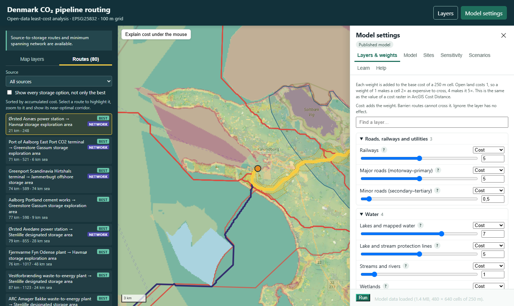

# CO₂ pipeline routing in Denmark

**Least-cost routes for CO₂ pipelines from Danish emitters to storage
sites, built entirely from open data, with an interactive map where every
assumption can be changed.**

Built to support a master's thesis on CO₂ capture and transport at the
University of Copenhagen (KU).

**Live demo:** <https://co2.michaelbinger.dk/>



## What it does

- Builds a **cost surface** for Denmark and its waters at 100 m. It uses
  35 open layers: roads, railways, water, wetlands, Natura 2000, §3
  nature, protected forest, drinking water, ancient monuments, beach
  protection, contaminated land, population and buildings, plus the marine
  spatial plan, wind farms, munitions, and subsea pipelines and cables.
- Finds the **least-cost route** from 8 emitters and hubs (cement, power,
  waste-to-energy, CO₂ terminals) to 10 storage sites taken from the
  Danish Energy Agency's licence areas: 80 routes.
- Joins all 18 sites with a **minimum spanning network**, and draws
  **near-optimal corridors** (1% and 3% above the optimum) for each route.
- **Validates** against the as-built Baltic Pipe: the model route is 3.5%
  longer than the real line, and its median distance from it is 13 km.
- **Lets you change everything in the browser.** Each layer can be a cost,
  a barrier or ignored. Weights, base costs, the safety distance and the
  overlap rules are adjustable, and sites can be added, moved or switched
  off. Routes recalculate in seconds. Hovering over the map explains why
  each place costs what it does.

## Who it is for

GIS students and analysts who want to understand, or rebuild, least-cost
routing for CO₂ infrastructure. The in-app **Learn** tab and the
[wiki](docs/wiki/README.md) explain:
- every layer and weight, and why it was chosen
- how the model was checked against a real pipeline
- how to rebuild the same model in **ArcGIS Pro**, tool by tool
- experiments worth trying

## Documentation

| | |
|---|---|
| [Wiki](docs/wiki/README.md) | method, weights, sources, data preparation, ArcGIS recipe, experiments, decisions, validation |
| [docs/method.md](docs/method.md) | technical method and ArcGIS equivalents |
| [docs/routing_practice.md](docs/routing_practice.md) | literature review of published cost multipliers and CO₂ safety distances |
| [docs/model_formula.md](docs/model_formula.md) | the exact 250 m formula the browser model implements |
| [data/SOURCES.md](data/SOURCES.md) | every dataset, with licence and link |
| [validation/README.md](validation/README.md) | the Baltic Pipe benchmark |
| [deploy/README.md](deploy/README.md) | running the static site in Docker behind a reverse proxy |

## Quick start

You need Python 3.11+ (Conda recommended) and about 25 GB of free disk
space for the raw data.

```bash
conda env create -f environment.yml
conda activate co2-routing

python -m src.acquire_data           # download and prepare the sources (hours, the first time)
python -m src.cost_surface           # 100 m cost surface (about 4 min)
python -m src.routing                # routes and network (about 4 min)
python -m src.corridors              # near-optimal corridors (about 4 min)
python -m src.export_model           # 250 m model pack for the browser
python -m src.build_web              # static map in web/ (about 5 min)
python -m validation.check_outputs   # sanity checks

python -m http.server 8000 --directory web   # then open http://localhost:8000
```

Three Datafordeler layers (beach protection, fredskov and power lines)
need a free API key, set as the environment variable
`DATAFORDELER_API_KEY`. Without it, those optional layers are skipped
with a warning.

All weights and settings are in [config/costs.yaml](config/costs.yaml).
Change a weight, then rerun from `cost_surface` onward. For quick
experiments, use the browser's **Model settings** instead.

## How it works

```
open data ──► acquire_data ──► cost_surface (100 m) ──► routing ──► build_web ──► static site
                                      │                    │
                                      └──► export_model (250 m pack) ──► browser engine (adjust + rerun)
```

- **Routing:** `skimage.graph.MCP_Geometric`, 8-connected. A step costs
  the mean of the two cells × the step length, which is the same rule as
  ArcGIS Cost Distance.
- **Browser engine:** a JavaScript reimplementation (`web/engine/`) on a
  250 m grid, running in a Web Worker. It is tested against the Python
  references: costs per cell agree to 2·10⁻⁷ and route costs to 10⁻⁸.
- **Map:** MapLibre GL JS. Overlays are pre-rendered tiles; the site is
  plain static files.

## Tests

```bash
python -m unittest discover -s tests -p "test_*.py"   # Node.js is needed for the browser-engine tests
python validation/ui_smoke.py http://localhost:8000/   # browser smoke test (needs Playwright)
```

## Limitations

- Weights are relative difficulty, not money. They follow published
  multipliers where these exist, and are judgement elsewhere.
- No terrain, landowner, permit-timing or capacity modelling. The network
  is a minimum spanning tree, not an optimised trunk-line design.
- Open data has gaps and quirks; `data/SOURCES.md` lists them.
- Site locations are representative points of public project and licence
  information, not engineering coordinates.

## How it was built

The project was developed in October 2026 by Michael Binger with two AI
coding agents, **Claude Code** (Anthropic) and **GitHub Copilot**, working
in parallel under a written collaboration protocol. The protocol is in
[docs/collab/agent-collaboration/SKILL.md](docs/collab/agent-collaboration/SKILL.md).
Every design decision was made by the project lead
([decisions](docs/wiki/decisions.md)).

## Licence and data

- **Code:** [MIT](LICENSE).
- **Data:** each dataset keeps its own licence (see
  [data/SOURCES.md](data/SOURCES.md)).
  - Outputs derived from OpenStreetMap (routes, the Baltic Pipe
    reference) are under the
    [ODbL](https://opendatacommons.org/licenses/odbl/), © OpenStreetMap
    contributors.
  - Danish public data is mostly under CC BY 4.0 or the Danish open-data
    terms.
  - Storage areas are © the Danish Energy Agency.

If you use this work, please cite it (see [CITATION.cff](CITATION.cff)).
